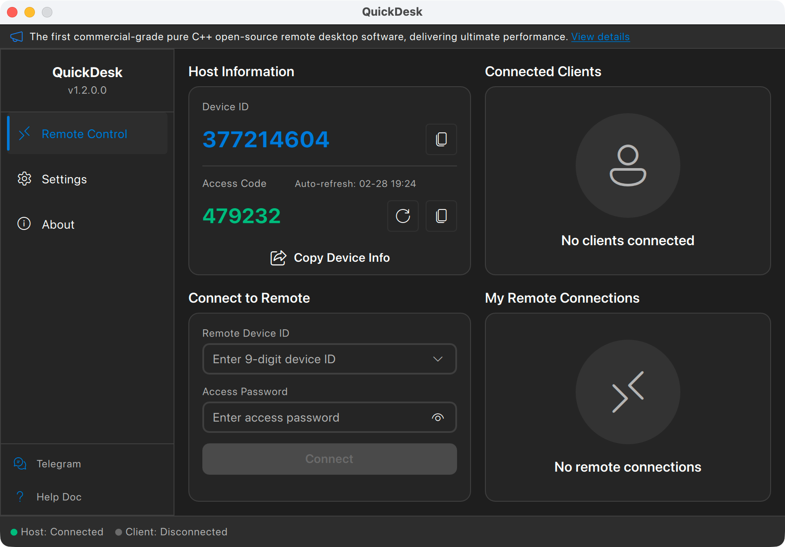
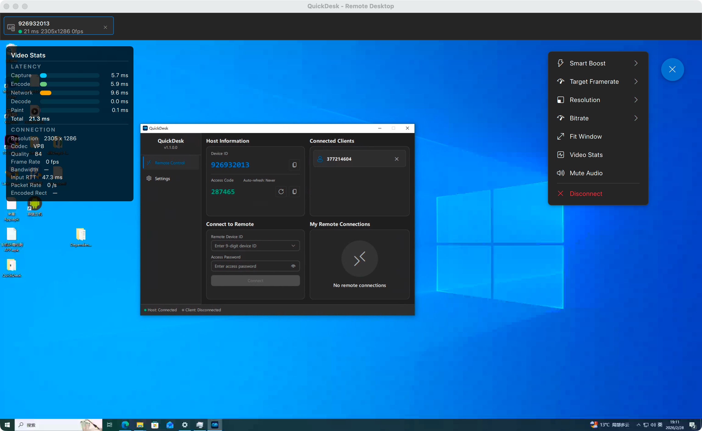
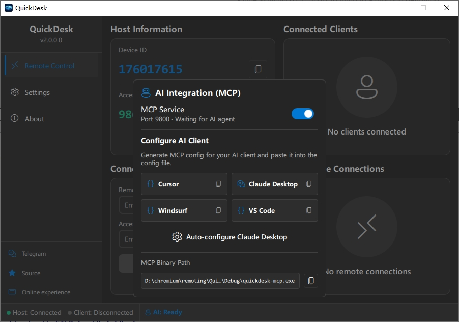
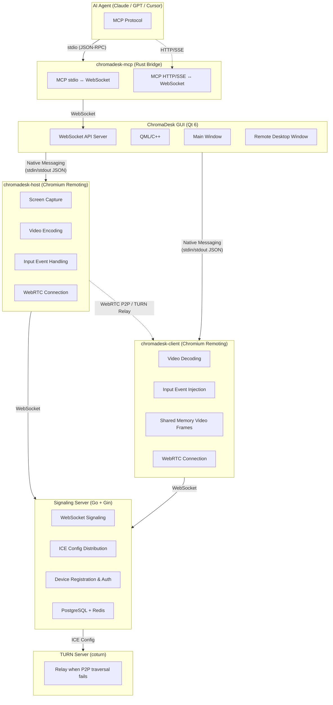

<p align="center">
  
</p>

<h1 align="center">ChromaDesk</h1>

<p align="center">
  <strong>The First AI-Native Remote Desktop</strong><br>
  Built-in MCP Server · AI Agents Control Any Remote Computer · Open-Source & Free
</p>

<p align="center">
  <a href="https://github.com/barry-ran/ChromaDesk/actions/workflows/chromadesk-windows.yml">
    
  </a>
  <a href="https://github.com/barry-ran/ChromaDesk/actions/workflows/chromadesk-macos.yml">
    
  </a>
  <a href="https://github.com/barry-ran/ChromaDesk/releases">
    
  </a>
  <a href="https://github.com/barry-ran/ChromaDesk/stargazers">
    
  </a>
  <a href="LICENSE">
    
  </a>
</p>

<p align="center">
  English | <a href="README_zh.md">中文</a>
</p>

<p align="center">
  <a href="https://t.me/+utsmSUhNLc1iNTY1">Telegram</a> | <a href="https://github.com/barry-ran/ChromaDesk/issues">Issues</a> | <a href="https://github.com/barry-ran/ChromaDesk/releases">Download</a>
</p>

---

ChromaDesk is the **first AI-native remote desktop** — an open-source, free application with a **built-in MCP (Model Context Protocol) Server** that lets any AI agent see and control remote computers.

While other remote desktop tools only serve human users, ChromaDesk extends **AI Computer Use** from "local machine only" to **"any remote machine in the world"**. Connect Claude, GPT, Cursor, or any MCP-compatible AI to ChromaDesk, and it can screenshot, click, type, drag, and automate across remote desktops — just like a human operator, but faster and 24/7.

Built on Google Chromium Remoting technology (the engine behind Chrome Remote Desktop), ChromaDesk delivers industrial-grade performance, stability, and security refined over 10+ years by Google.

Main Interface


Remote Desktop


AI Config


## Why ChromaDesk?

### AI-First: The Only Remote Desktop with MCP Support  [ → MCP Integration Guide](docs/mcp-integration.md)

- **Built-in MCP Server**: AI agents connect via standard MCP protocol — no plugins, no hacks, zero configuration
- **Dual Transport**: stdio mode (AI client spawns process) or HTTP/SSE mode (ChromaDesk hosts MCP server for multi-client access)
- **Full Computer Use Toolkit**: 20+ MCP tools — screenshot, click, type, drag, scroll, hotkeys, clipboard, and more
- **Real-Time Visibility**: AI operations are displayed in the ChromaDesk GUI in real time — the user sees every mouse move and keystroke, and can intervene at any time
- **Multi-Device AI Orchestration**: AI can connect to and control multiple remote machines simultaneously — batch automation, cross-device workflows, fleet management
- **Guided Prompts**: 9 built-in MCP prompt templates covering remote operation, server health check, batch automation, system diagnosis, screen analysis, multi-device orchestration, and SOP documentation

### High-Performance Foundation

- **Open-Source & Free**: MIT License, no feature restrictions, no connection limits, commercial use welcome
- **Self-Hosted**: Deploy your own signaling and TURN relay servers, keep full control of your data
- **Commercial-Grade Foundation**: Built on Chromium Remoting — the same technology powering Chrome Remote Desktop, refined by Google for 10+ years and proven by billions of users
- **Pure C++ Ultimate Performance**: Full C++ stack from protocol core to GUI — no GC pauses, no runtime overhead, minimal memory and CPU footprint
- **Modern Codecs**: H.264, VP8, VP9, AV1 — flexibly switch based on network and hardware conditions
- **WebRTC P2P Direct Connection**: Prioritizes peer-to-peer connections for lowest latency; automatically falls back to TURN relay when traversal fails
- **Cross-Platform**: Windows and macOS supported (Linux planned)
- **Modern UI**: Fluent Design interface built with Qt 6 + QML, with light and dark themes

## Comparison

| Feature | ChromaDesk | RustDesk | BildDesk | ToDesk | TeamViewer |
|---------|:---------:|:--------:|:--------:|:------:|:----------:|
| **AI Agent Support (MCP)** | ✅ Built-in | ❌ | ❌ | ❌ | ❌ |
| **Open Source** | ✅ MIT | ✅ AGPL-3.0 | ❌ | ❌ | ❌ |
| **Free for Commercial Use** | ✅ | ❌ License required | ❌ | ❌ | ❌ |
| **Core Language** | C++ | Rust + Dart | — | — | — |
| **Remote Protocol** | Chromium Remoting (WebRTC) | Custom | Custom | Custom | Custom |
| **Protocol Maturity** | ⭐⭐⭐⭐⭐ Google 10yr+ | ⭐⭐⭐ | ⭐⭐ | ⭐⭐⭐ | ⭐⭐⭐⭐⭐ |
| **P2P Direct** | ✅ WebRTC ICE | ✅ TCP Hole Punching | ✅ | ✅ | ✅ |
| **Video Codecs** | H.264/VP8/VP9/AV1 | VP8/VP9/AV1/H.264/H.265 | — | — | — |
| **Self-Hosted** | ✅ Full solution | ✅ | ❌ | ❌ | ❌ |
| **GUI Framework** | Qt 6 (C++) | Flutter (Dart) | — | — | — |
| **Memory Usage** | ⭐⭐⭐⭐⭐ Very Low | ⭐⭐⭐ Medium | — | ⭐⭐⭐ | ⭐⭐⭐ |
| **CPU Usage** | ⭐⭐⭐⭐⭐ Very Low | ⭐⭐⭐ Medium | — | ⭐⭐⭐ | ⭐⭐⭐ |
| **Windows** | ✅ | ✅ | ✅ | ✅ | ✅ |
| **macOS** | ✅ | ✅ | ✅ | ✅ | ✅ |
| **Linux** | 🔜 | ✅ | ❌ | ✅ | ✅ |
| **iOS/Android** | 🔜 | ✅ | ✅ | ✅ | ✅ |

### Why Best-in-Class Performance?

1. **Pure C++ Full Stack**: The entire stack — from low-level protocol to GUI — is implemented in C++. No garbage collection pauses, no VM/runtime overhead. Compared to RustDesk's Dart/Flutter GUI layer or ToDesk's Electron-based approach, CPU and memory usage are significantly lower.

2. **Chromium-Level Optimization**: Core paths for video encoding/decoding, network transmission, and screen capture directly reuse Chromium's highly optimized C++ code, including SIMD instruction optimization and zero-copy rendering pipelines.

3. **Shared Memory Video Transfer**: ChromaDesk uses shared memory to pass video frames (YUV I420) between processes, eliminating the serialization/deserialization and data copying overhead of traditional IPC.

4. **GPU-Accelerated Rendering**: YUV data is fed directly into the GPU rendering pipeline via Qt 6's `QVideoSink`, achieving zero-CPU-copy video rendering.

## Features

### AI Integration (MCP Server)
- Built-in MCP Server — AI agents connect via standard protocol, works with Cursor, Claude Desktop, VS Code, and any MCP client
- Dual transport: stdio (AI client launches process) or HTTP/SSE (ChromaDesk manages MCP server, multiple AI clients connect)
- Persistent MCP transport mode — remembers your stdio/HTTP choice across restarts
- 40+ MCP tools: screenshot, mouse click/drag/scroll, keyboard type/hotkey, clipboard, OCR text recognition, UI element detection, screen verification, and more
- Host-side skill host with built-in skills (system info, file operations, shell execution) — run structured tools on the remote machine
- Pluggable skills architecture — add custom skill directories, skills auto-load and sync to connected clients
- Skill host toggle in Settings — enable/disable the skill host process with persistent configuration
- MCP Resources: real-time device status, connection info, host details
- 9 MCP Prompts: operation guide, server health check, batch automation, system diagnosis, screen analysis, multi-device orchestration, SOP documentation
- Real-time event streaming: connection state changes, clipboard updates, screen changes, performance stats
- Event-driven tools: wait_for_event, wait_for_connection_state, wait_for_clipboard_change, wait_for_screen_change for reactive automation
- Background automation mode: `show_window=false` for headless batch operations
- Screenshot scaling: adjustable resolution for faster AI processing

### Remote Control
- High-definition, low-latency remote desktop display
- Full keyboard and mouse mapping
- Real-time remote cursor synchronization
- Bidirectional clipboard sync
- Adaptive frame rate and bitrate
- Frame rate boost mode (Office / Gaming)
- Privacy screen mode — blacks out the host's physical display and blocks local keyboard/mouse input during remote control, protecting session privacy (Windows 10 2004+)
- Virtual display — creates virtual monitors via IDD driver for multi-screen extension, headless server remote access, privacy isolation, and resolution adaptation (Windows 10 2004+, requires virtual display driver installation)

### Connection Management
- 9-digit Device ID + temporary access code mechanism
- Auto-refresh access code (configurable: 30 min to 24 hours, or never)
- Multi-tab simultaneous connections to multiple remote devices
- Connection history with quick reconnect
- Real-time connection status monitoring

### Performance Monitoring
- Detailed latency breakdown panel (Capture → Encode → Network → Decode → Render)
- Real-time frame rate, bitrate, and bandwidth statistics
- Input round-trip time (RTT) monitoring
- Encoding resolution and quality information

### Personalization
- Fluent Design style interface
- Light and dark theme switching
- i18n support (Chinese / English)
- Video codec preference (H.264 / VP8 / VP9 / AV1)

### Self-Hosted Deployment
- Custom signaling server address
- Custom STUN/TURN servers
- Complete server deployment solution (Go signaling server + PostgreSQL + Redis + coturn)
- **Web Admin Panel** — full-featured management dashboard for the signaling server:
  - Real-time monitoring with ECharts trend charts (connections, new devices over 24h/7d/30d)
  - Device management with search, filter, sort, pagination, batch operations, and device groups
  - User management with batch enable/disable/delete/set-level
  - Admin TOTP two-factor authentication (QR code setup, Google Authenticator compatible)
  - Operation audit logs with filtering by action/admin/time range
  - IP whitelist (CIDR support) for admin panel access control
  - Webhook notifications (device online/offline, new device/user, connection failures)
  - CSV data export for devices, users, and activity logs

## Architecture

ChromaDesk uses a modular multi-process architecture:



### Tech Stack

| Layer | Technology |
|-------|------------|
| AI Integration | MCP Server (Rust) + WebSocket API |
| GUI Client | Qt 6 (QML + C++17) |
| UI Style | Fluent Design Component Library (custom-built) |
| Remote Protocol Core | Chromium Remoting (C++) |
| Video Codecs | H.264 / VP8 / VP9 / AV1 |
| Network Transport | WebRTC (ICE/STUN/TURN) |
| IPC | Native Messaging (JSON) + Shared Memory |
| Signaling Server | Go + Gin + GORM |
| Data Storage | PostgreSQL + Redis |
| TURN Relay | coturn |
| Logging | spdlog |
| Build System | CMake 3.19+ |
| CI/CD | GitHub Actions |

## Getting Started

### Download

Go to [Releases](https://github.com/barry-ran/ChromaDesk/releases) to download the latest version:

| Platform | Download |
|----------|----------|
| Windows x64 | [ChromaDesk-win-x64-setup.exe](https://github.com/barry-ran/ChromaDesk/releases/latest) |
| macOS ARM64 | [ChromaDesk-mac-arm64.dmg](https://github.com/barry-ran/ChromaDesk/releases/latest) |

### Usage

1. Install and run ChromaDesk on both the **host** (remote) and **client** (local) machines
2. The host will automatically generate a **Device ID** and **Access Code**
3. On the client, enter the host's Device ID and Access Code, then click **Connect**
4. You're now remotely controlling the host machine

### Silent install (Windows installer)

The Windows package is built with **Inno Setup** (`scripts/installer/chromadesk.iss`). Standard Inno command-line switches apply:

| Switch | Meaning |
|--------|---------|
| `/SILENT` | No wizard pages; progress window may appear |
| `/VERYSILENT` | Fully unattended (no progress window) |
| `/DIR="path"` | Install directory (optional) |
| `/TASKS="..."` | Comma-separated tasks from `[Tasks]` |

Available tasks:

| Task | Description |
|------|-------------|
| `desktopicon` | Create desktop shortcut |
| `startmenuicon` | Create Start Menu shortcut |
| `vdd` | Install virtual display driver (IDD) and related files, required for virtual display feature |

All three tasks are selected by default (`Flags: checkedonce` — checked on first install, preserves user choice on upgrades). To skip the virtual display driver, explicitly exclude `vdd` via `/TASKS`.

Examples:

```bat
REM Default tasks (includes virtual display driver when selected in script defaults)
ChromaDesk-win-x64-setup.exe /VERYSILENT

REM Explicit tasks
ChromaDesk-win-x64-setup.exe /VERYSILENT /TASKS="desktopicon,startmenuicon,vdd"

REM Install without virtual display driver
ChromaDesk-win-x64-setup.exe /VERYSILENT /TASKS="desktopicon,startmenuicon"

REM Custom install path
ChromaDesk-win-x64-setup.exe /VERYSILENT /DIR="D:\ChromaDesk"
```

After a silent install, **ChromaDesk.exe is not auto-launched** (`skipifsilent` in the installer script), but the **ChromaDeskHost** Windows service is still installed and started when configured in `[Run]`.

Administrator rights are required (`PrivilegesRequired=admin` in the script).

## Build from Source

### Requirements

- CMake 3.19+
- Qt 6.5+ (Multimedia and WebSockets modules required)
- C++17 compiler

### Windows

```bash
# Requires Visual Studio 2022 + MSVC
# Set Qt path environment variable
set ENV_QT_PATH=C:\Qt\6.8.3

# Build
scripts\build_qd_win.bat Release

# Package (requires Inno Setup)
scripts\publish_qd_win.bat Release
scripts\package_qd_win.bat Release
```

### macOS

```bash
# Requires Xcode Command Line Tools
# Set Qt path environment variable
export ENV_QT_PATH=/path/to/Qt/6.8.3

# Build
bash scripts/build_qd_mac.sh Release

# Package
bash scripts/publish_qd_mac.sh Release
bash scripts/package_qd_mac.sh Release
```

### API Key (Optional)

If you deploy your own signaling server with API Key enabled, there are two ways to configure the API Key:

**Method 1: Runtime Configuration (Recommended)**

In ChromaDesk **Settings → Network → API Key**, enter your signaling server's API Key. This is the recommended approach — no recompilation needed, and each deployment can use its own key.

**Method 2: Build-time Injection**

You can also inject the API Key at build time as a compile-time default:

```bash
# Windows
set ENV_CHROMADESK_API_KEY=your-secret-key
scripts\build_qd_win.bat Release

# macOS
ENV_CHROMADESK_API_KEY=your-secret-key bash scripts/build_qd_mac.sh Release
```

> **Priority**: Runtime API Key (from Settings) takes precedence over the build-time key. If both are set, the runtime value is used.

Without either configuration, the client can only connect to signaling servers without API Key protection.

> **WebClient note:** The WebClient is a static web page running in the browser. Since API keys embedded in JavaScript are visible via DevTools, the WebClient uses **Origin whitelist** validation instead of API Key. Configure `ALLOWED_ORIGINS` on the signaling server to restrict which domains can access it. Browsers automatically send the `Origin` header and JavaScript cannot forge it, so only the WebClient served from your official domain will be allowed.

See [Signaling Server Deployment](docs/signaling-server-deployment.md) for details.

## Self-Hosted Deployment

ChromaDesk supports full self-hosted deployment. You can deploy all services on your own servers to ensure data security.

### Components

1. **Signaling Server** (required): Handles device registration and signaling relay
   → [Signaling Server Deployment Guide](docs/signaling-server-deployment.md)
2. **TURN Relay Server** (recommended): Provides relay when P2P direct connection fails
   → [TURN Server Deployment Guide](docs/turn-server-deployment.md)

### Docker Deploy (Signaling Server)

Three deployment methods for the signaling server:

```bash
cd SignalingServer
cp .env.example .env && vim .env

# Option 1: Pull pre-built image (recommended)
./deploy-pull.sh

# Option 2: Build from source
./deploy-build.sh

# Option 3: Offline deploy (no internet needed)
./deploy-offline.sh chromadesk-signaling-image.tar.gz
```

Pre-built Docker images are automatically published to `ghcr.io/barry-ran/chromadesk-signaling` on each tagged release. See the [deployment guide](docs/signaling-server-deployment.md) for details.

### Client Configuration

In ChromaDesk **Settings → Network**:
- Signaling server address: `ws://your-server.com:8000` or `wss://your-server.com:8000`
- API Key: Enter the API Key configured on your signaling server (if enabled)
- Custom STUN server: `stun:your-server.com:3478`
- Custom TURN server: `turn:your-server.com:3478` (username and password required)

## Project Structure

```
ChromaDesk/
├── ChromaDesk/                    # Qt GUI client
│   ├── main.cpp                  # Application entry point
│   ├── src/
│   │   ├── api/                  # WebSocket API server + request handlers
│   │   ├── controller/           # Main controller
│   │   ├── manager/              # Business managers (Host/Client/Process/TURN/...)
│   │   ├── component/            # Video rendering, key mapping, cursor sync
│   │   ├── core/                 # Config center, user data
│   │   ├── viewmodel/            # MVVM ViewModel
│   │   └── language/             # i18n
│   ├── qml/
│   │   ├── views/                # Main window, remote desktop window
│   │   ├── pages/                # Remote control, settings, about pages
│   │   ├── component/            # Fluent Design component library
│   │   └── chromadeskcomponent/   # ChromaDesk-specific components
│   ├── base/                     # Base utilities
│   └── infra/                    # Infrastructure (database, logging, HTTP)
├── chromadesk-mcp/                # Rust MCP Bridge (stdio ↔ WebSocket)
│   └── src/
│       ├── main.rs               # Entry point, CLI args, MCP server startup
│       ├── server.rs             # MCP tools, prompts, resources
│       └── ws_client.rs          # WebSocket client for Qt API
├── chromadesk-skill-host/         # Rust host-side skill host (Cargo workspace)
│   ├── agent/                    # Skill host main binary
│   ├── mcp-server-common/        # Shared MCP server framework
│   └── skills/                   # Built-in skill MCP servers
│       ├── sys-info/             # System information skill
│       ├── file-ops/             # File operations skill
│       └── shell-runner/         # Shell execution skill
├── SignalingServer/              # Go signaling server
│   ├── cmd/signaling/            # Entry point
│   └── internal/                 # Business logic
├── scripts/                      # Build, package, publish scripts
├── docs/                         # Documentation
│   ├── mcp-integration.md        # MCP integration guide (English)
│   └── MCP接入指南.md             # MCP integration guide (Chinese)
├── .github/workflows/            # CI/CD configuration
└── version                       # Version number
```

## Roadmap

- [x] Windows support
- [x] macOS support
- [x] P2P direct connection + TURN relay
- [x] Multi-tab multi-connection
- [x] Auto-refresh access code
- [x] Video performance stats overlay
- [x] Fluent Design UI
- [x] Light and dark themes
- [x] i18n (Chinese / English)
- [x] **MCP Server — AI agents can control remote desktops**
- [x] **20+ MCP tools (screenshot, click, type, drag, hotkey, clipboard, etc.)**
- [x] **MCP Resources & Prompts**
- [x] **Host-side skill host with built-in skills (sys-info, file-ops, shell-runner)**
- [x] **OCR-based UI analysis tools (get_ui_state, find_element, screen_diff_summary, etc.)**
- [x] **Persistent MCP transport mode and skill host settings**
- [x] **Multi-directory skills loading with user-configurable paths**
- [x] **Device memory & history retrieval (auto-profiling, operation logs, failure patterns)**
- [x] **Workflow recording & playback (record, replay, parameterize)**
- [x] **Trust layer & safety (risk assessment, confirmation dialogs, emergency stop, audit log)**
- [x] **Privacy screen — blacks out host physical display and blocks local input during remote sessions**
- [x] **Virtual display — IDD virtual display driver for multi-screen extension, headless remote, and resolution adaptation**
- [x] File transfer
- [x] Audio streaming
- [x] Unattended access
- [ ] Linux support
- [ ] iOS / Android clients
- [ ] Address book & device groups

## Contributing

Contributions are welcome! Please follow these guidelines:

1. Fork the repository and create a feature branch
2. Keep code style consistent with the project
3. Ensure the build passes before submitting a PR
4. Each PR should contain a single feature or fix

## License

ChromaDesk's own code is licensed under the [MIT License](LICENSE), free for commercial use.

The bundled `chromadesk-remoting` component is based on Chromium and licensed under the [BSD 3-Clause License](https://chromium.googlesource.com/chromium/src/+/refs/heads/main/LICENSE).

For complete third-party license information, see [THIRD_PARTY_LICENSES](THIRD_PARTY_LICENSES).

## Acknowledgments

- [Chromium Remoting](https://chromium.googlesource.com/chromium/src/+/refs/tags/140.0.7339.249/remoting/) — Remote desktop protocol core
- [Qt](https://www.qt.io/) — Cross-platform GUI framework
- [spdlog](https://github.com/gabime/spdlog) — High-performance logging library
- [coturn](https://github.com/coturn/coturn) — TURN relay server

## Star History

[](https://star-history.com/#barry-ran/ChromaDesk&Date)
