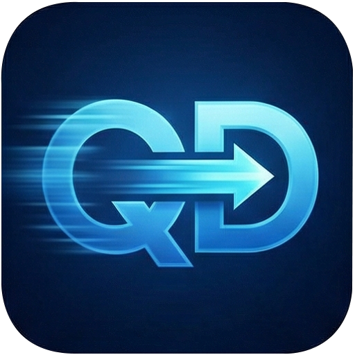
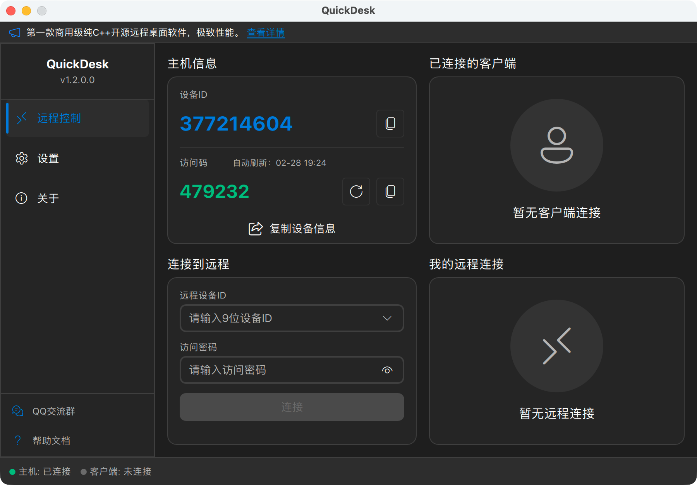
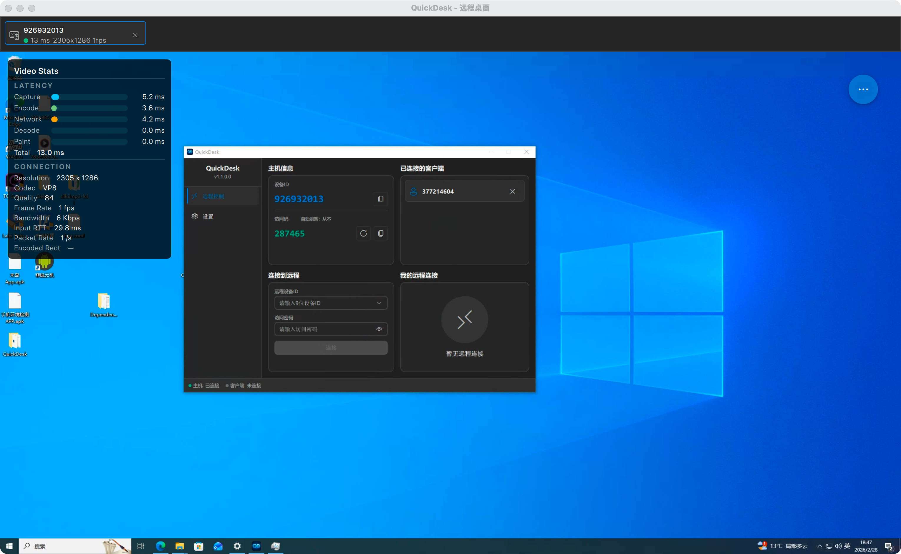
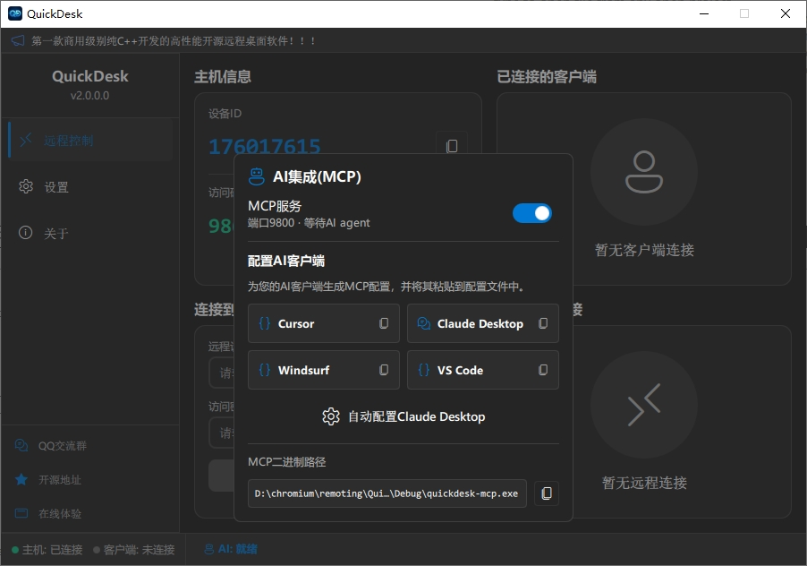
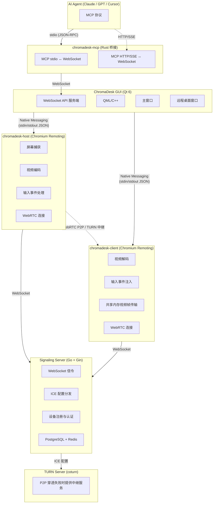

<p align="center">
  
</p>

<h1 align="center">ChromaDesk</h1>

<p align="center">
  <strong>首款 AI 原生远程桌面</strong><br>
  内置 MCP Server · AI Agent 操控任意远程电脑 · 开源免费
</p>

<p align="center">
  <a href="https://github.com/barry-ran/ChromaDesk/actions/workflows/chromadesk-windows.yml">
    
  </a>
  <a href="https://github.com/barry-ran/ChromaDesk/actions/workflows/chromadesk-macos.yml">
    
  </a>
  <a href="https://github.com/barry-ran/ChromaDesk/releases">
    
  </a>
  <a href="https://github.com/barry-ran/ChromaDesk/stargazers">
    
  </a>
  <a href="https://gitcode.com/barry-ran/ChromaDesk">
    
  </a>
  <a href="LICENSE">
    
  </a>
</p>

<p align="center">
  <a href="README.md">English</a> | 中文
</p>

<p align="center">
  <a href="https://qm.qq.com/q/VON417Xdyo">QQ 交流群</a> | <a href="https://github.com/barry-ran/ChromaDesk/issues">Issues</a> | <a href="https://github.com/barry-ran/ChromaDesk/releases">下载</a>
</p>

---

ChromaDesk 是**首款 AI 原生远程桌面** —— 一款开源免费的远程桌面软件，**内置 MCP (Model Context Protocol) Server**，让任何 AI Agent 都能看到和操控远程电脑。

其他远程桌面工具只服务于人类用户，而 ChromaDesk 将 **AI Computer Use** 从"只能操作本机"扩展到**"操作世界上任何一台远程设备"**。将 Claude、GPT、Cursor 或任何 MCP 兼容的 AI 接入 ChromaDesk，即可截图、点击、输入、拖拽，在远程桌面上自动化执行任务 —— 像人一样操作，但更快、更持久，7×24 不间断。

底层基于 Google Chromium Remoting 技术架构（Chrome Remote Desktop 背后的引擎），经过十多年大规模商用验证，性能、稳定性和安全性都达到工业级水准。

主界面


远程桌面


AI配置


## 为什么选择 ChromaDesk？

### AI 优先：唯一内置 MCP 的远程桌面  [ → MCP 接入指南](docs/MCP接入指南.md)

- **内置 MCP Server**：AI Agent 通过标准 MCP 协议连接 —— 无需插件、无需 Hack、零配置
- **双传输模式**：stdio 模式（AI 客户端启动进程）或 HTTP/SSE 模式（ChromaDesk 托管 MCP 服务器，支持多客户端同时连接）
- **完整的 Computer Use 工具集**：20+ MCP 工具 —— 截图、点击、输入、拖拽、滚动、快捷键、剪贴板等
- **实时可见**：AI 的所有操作实时显示在 ChromaDesk 界面中 —— 用户看到每一次鼠标移动和键盘输入，随时可以干预
- **多设备 AI 编排**：AI 可同时连接控制多台远程设备 —— 批量自动化、跨设备工作流、设备集群管理
- **内置操作指南**：9 个 MCP Prompt 模板，覆盖远程操作、服务器健康检查、批量自动化、故障诊断、屏幕分析、多设备编排、SOP 文档生成

### 高性能基座

- **开源免费**：MIT 许可证，商用无忧，无功能限制，无连接数限制
- **私有化部署**：自建信令服务器和 TURN 中继服务器，数据完全掌控在自己手中
- **商用级底座**：基于 Chromium Remoting —— 驱动 Chrome Remote Desktop 的同一套技术，经过 Google 十年+打磨、全球亿级用户验证
- **纯 C++ 极致性能**：从远程协议核心到 GUI 应用全栈 C++，无 GC 停顿、无运行时开销，内存和 CPU 占用极低
- **现代编解码**：支持 H.264、VP8、VP9、AV1 等多种编码，可根据网络和硬件灵活切换
- **WebRTC P2P 直连**：优先建立端到端直连，延迟最低；穿透失败自动回退 TURN 中继
- **跨平台**：支持 Windows 和 macOS（Linux 计划中）
- **现代化 UI**：Qt 6 + QML 打造的 Fluent Design 风格界面，支持明暗主题

## 竞品对比

| 特性 | ChromaDesk | RustDesk | BildDesk | ToDesk | TeamViewer |
|------|:---------:|:--------:|:--------:|:------:|:----------:|
| **AI Agent 支持 (MCP)** | ✅ 内置 | ❌ | ❌ | ❌ | ❌ |
| **开源** | ✅ MIT | ✅ AGPL-3.0 | ❌ | ❌ | ❌ |
| **免费商用** | ✅ | ❌ 需商业授权 | ❌ | ❌ | ❌ |
| **核心语言** | C++ | Rust + Dart | — | — | — |
| **远程协议** | Chromium Remoting (WebRTC) | 自研 | 自研 | 自研 | 自研 |
| **协议成熟度** | ⭐⭐⭐⭐⭐ Google 10年+商用 | ⭐⭐⭐ | ⭐⭐ | ⭐⭐⭐ | ⭐⭐⭐⭐⭐ |
| **P2P 直连** | ✅ WebRTC ICE | ✅ TCP 打洞 | ✅ | ✅ | ✅ |
| **视频编码** | H.264/VP8/VP9/AV1 | VP8/VP9/AV1/H.264/H.265 | — | — | — |
| **私有化部署** | ✅ 完整方案 | ✅ | ❌ | ❌ | ❌ |
| **GUI 框架** | Qt 6 (C++) | Flutter (Dart) | — | — | — |
| **内存占用** | ⭐⭐⭐⭐⭐ 极低 | ⭐⭐⭐ 中等 | — | ⭐⭐⭐ | ⭐⭐⭐ |
| **CPU 占用** | ⭐⭐⭐⭐⭐ 极低 | ⭐⭐⭐ 中等 | — | ⭐⭐⭐ | ⭐⭐⭐ |
| **Windows** | ✅ | ✅ | ✅ | ✅ | ✅ |
| **macOS** | ✅ | ✅ | ✅ | ✅ | ✅ |
| **Linux** | 🔜 | ✅ | ❌ | ✅ | ✅ |
| **iOS/Android** | 🔜 | ✅ | ✅ | ✅ | ✅ |

### 为什么性能最好？

1. **纯 C++ 全栈**：从底层协议到上层 GUI 全部使用 C++ 实现，无 GC（垃圾回收）带来的停顿抖动，无 VM/Runtime 开销。相比 RustDesk 的 Dart/Flutter GUI 层、ToDesk 等使用 Electron 的方案，CPU 和内存占用显著更低。

2. **Chromium 级别优化**：视频编解码、网络传输、屏幕捕获等核心路径直接复用 Chromium 中经过极致性能调优的 C++ 代码，包括 SIMD 指令优化、零拷贝渲染管线等。

3. **共享内存视频传输**：ChromaDesk 采用共享内存在进程间传递视频帧（YUV I420），避免了传统 IPC 的序列化/反序列化和数据拷贝开销。

4. **GPU 加速渲染**：通过 Qt 6 的 `QVideoSink` 直接将 YUV 数据送入 GPU 渲染管线，实现零 CPU 拷贝的视频渲染。

## 功能

### AI 集成（MCP Server）
- 内置 MCP Server —— AI Agent 通过标准协议连接，支持 Cursor、Claude Desktop、VS Code 等所有 MCP 客户端
- 双传输模式：stdio（AI 客户端启动进程）或 HTTP/SSE（ChromaDesk 管理 MCP 服务器，多个 AI 客户端同时连接）
- MCP 传输模式持久化 —— 记住 stdio/HTTP 选择，重启后自动恢复
- 40+ MCP 工具：截图、鼠标点击/拖拽/滚动、键盘输入/快捷键、剪贴板、OCR 文字识别、UI 元素检测、屏幕验证等
- 主机端技能宿主，内置技能（系统信息、文件操作、Shell 执行）—— 在远程机器上运行结构化工具
- 可插拔技能架构 —— 支持添加自定义 skills 目录，技能自动加载并同步给已连接客户端
- 设置中的技能宿主开关 —— 启用/禁用技能宿主进程，持久化配置
- MCP Resources：实时设备状态、连接信息、主机详情
- 9 个 MCP Prompts：操作指南、服务器健康检查、批量自动化、故障诊断、屏幕分析、多设备编排、SOP 文档生成
- 实时事件推送：连接状态变化、剪贴板更新、屏幕变化、性能统计
- 事件驱动工具：wait_for_event、wait_for_connection_state、wait_for_clipboard_change、wait_for_screen_change，支持响应式自动化
- 后台自动化模式：`show_window=false` 无界面批量操作
- 截图缩放：可调分辨率，加速 AI 处理

### 远程控制
- 高清低延迟远程桌面显示
- 键盘和鼠标完整映射控制
- 远程光标实时同步
- 剪贴板双向同步
- 自适应帧率与码率
- 帧率增强模式（办公 / 游戏）
- 隐私屏幕模式 —— 远程控制时黑屏被控端物理显示器并阻断本地键鼠输入，保护操作隐私（Windows 10 2004+）
- 虚拟屏 —— 通过 IDD 驱动创建虚拟显示器，支持多屏扩展、Headless 服务器远程、隐私隔离及分辨率自适应（Windows 10 2004+，需安装虚拟显示器驱动）

### 连接管理
- 9 位设备 ID + 临时访问码机制
- 访问码自动刷新（可配置 30 分钟~24 小时或永不刷新）
- 多标签页同时连接多台远程设备
- 连接历史记录与快速重连
- 实时连接状态监控

### 性能监控
- 详细的延迟分解面板（捕获 → 编码 → 网络 → 解码 → 渲染）
- 实时帧率、码率、带宽统计
- 输入往返时延（Input RTT）监测
- 编码分辨率、编码质量信息

### 个性化
- Fluent Design 风格界面
- 明暗主题切换
- 中英文国际化支持
- 视频编码偏好设置（H.264 / VP8 / VP9 / AV1）

### 私有化部署
- 自定义信令服务器地址
- 自定义 STUN/TURN 服务器
- 完整的服务端部署方案（Go 信令服务器 + PostgreSQL + Redis + coturn）

## 架构

ChromaDesk 采用模块化多进程架构：



### 技术栈

| 层级 | 技术 |
|------|------|
| AI 集成 | MCP Server (Rust) + WebSocket API |
| GUI 客户端 | Qt 6 (QML + C++17) |
| UI 风格 | Fluent Design 组件库（自研） |
| 远程协议核心 | Chromium Remoting (C++) |
| 音视频编解码 | H.264 / VP8 / VP9 / AV1 |
| 网络传输 | WebRTC (ICE/STUN/TURN) |
| 进程间通信 | Native Messaging (JSON) + 共享内存 |
| 信令服务器 | Go + Gin + GORM |
| 数据存储 | PostgreSQL + Redis |
| TURN 中继 | coturn |
| 日志 | spdlog |
| 构建系统 | CMake 3.19+ |
| CI/CD | GitHub Actions |

## 快速开始

### 下载安装

前往 [Releases](https://github.com/barry-ran/ChromaDesk/releases) 下载最新版本：

| 平台 | 下载 |
|------|------|
| Windows x64 | [ChromaDesk-win-x64-setup.exe](https://github.com/barry-ran/ChromaDesk/releases/latest) |
| macOS ARM64 | [ChromaDesk-mac-arm64.dmg](https://github.com/barry-ran/ChromaDesk/releases/latest) |

### 使用方法

1. 在**被控端**和**主控端**分别安装并运行 ChromaDesk
2. 被控端会自动生成 **设备 ID** 和 **访问码**
3. 在主控端输入被控端的设备 ID 和访问码，点击**连接**
4. 连接成功后即可远程控制

### 静默安装（Windows 安装包）

Windows 安装程序由 **Inno Setup** 生成（`scripts/installer/chromadesk.iss`），可使用 Inno 标准命令行参数：

| 参数 | 说明 |
|------|------|
| `/SILENT` | 不显示向导页，可能仍显示进度窗口 |
| `/VERYSILENT` | 完全无人值守（不显示进度窗口） |
| `/DIR="路径"` | 指定安装目录（可选） |
| `/TASKS="..."` | 逗号分隔的任务列表，对应脚本 `[Tasks]` |

可选任务：

| 任务名 | 说明 |
|--------|------|
| `desktopicon` | 创建桌面快捷方式 |
| `startmenuicon` | 创建开始菜单快捷方式 |
| `vdd` | 安装虚拟显示器驱动（IDD）及相关文件，虚拟屏功能所需 |

三个任务默认均为勾选（`Flags: checkedonce`，首次安装默认勾选，升级安装保留用户上次选择）。若不需要虚拟显示器驱动，可通过 `/TASKS` 显式排除 `vdd`。

示例：

```bat
REM 使用安装程序默认勾选的任务（通常包含虚拟显示器驱动）
ChromaDesk-win-x64-setup.exe /VERYSILENT

REM 显式指定任务
ChromaDesk-win-x64-setup.exe /VERYSILENT /TASKS="desktopicon,startmenuicon,vdd"

REM 不安装虚拟显示器驱动及对应文件
ChromaDesk-win-x64-setup.exe /VERYSILENT /TASKS="desktopicon,startmenuicon"

REM 指定安装目录
ChromaDesk-win-x64-setup.exe /VERYSILENT /DIR="D:\ChromaDesk"
```

静默安装完成后，**不会自动启动 ChromaDesk 主界面**（安装脚本中为 `skipifsilent`），但 **`ChromaDeskHost` Windows 服务**仍按 `[Run]` 段配置执行安装与启动。

安装需要**管理员权限**（脚本中 `PrivilegesRequired=admin`）。

## 从源码编译

### 环境要求

- CMake 3.19+
- Qt 6.5+（需要 Multimedia、WebSockets 模块）
- C++17 编译器

### Windows

```bash
# 需要 Visual Studio 2022 + MSVC
# 设置 Qt 路径环境变量
set ENV_QT_PATH=C:\Qt\6.8.3

# 编译
scripts\build_qd_win.bat Release

# 打包（需要 Inno Setup）
scripts\publish_qd_win.bat Release
scripts\package_qd_win.bat Release
```

### macOS

```bash
# 需要 Xcode Command Line Tools
# 设置 Qt 路径环境变量
export ENV_QT_PATH=/path/to/Qt/6.8.3

# 编译
bash scripts/build_qd_mac.sh Release

# 打包
bash scripts/publish_qd_mac.sh Release
bash scripts/package_qd_mac.sh Release
```

### API Key（可选）

如果你部署了自己的信令服务器并启用了 API Key，有两种方式配置 API Key：

**方式一：运行时配置（推荐）**

在 ChromaDesk **设置 → 网络 → API Key** 中填入信令服务器的 API Key。推荐使用此方式——无需重新编译，每个部署可以使用不同的 Key。

**方式二：编译时注入**

也可以在编译时注入 API Key 作为编译时默认值：

```bash
# Windows
set ENV_CHROMADESK_API_KEY=your-secret-key
scripts\build_qd_win.bat Release

# macOS
ENV_CHROMADESK_API_KEY=your-secret-key bash scripts/build_qd_mac.sh Release
```

> **优先级**：运行时 API Key（来自设置界面）优先于编译时注入的 Key。如果两者都设置了，使用运行时的值。

不配置任何 API Key 时，客户端只能连接未开启 API Key 保护的信令服务器。

> **WebClient 说明：** WebClient 是运行在浏览器中的静态网页，嵌入到 JS 中的 API Key 可通过 DevTools 看到，因此 WebClient 采用 **Origin 域名白名单** 验证而非 API Key。在信令服务器配置 `ALLOWED_ORIGINS` 来限制允许访问的域名。浏览器会自动发送 `Origin` 请求头且 JavaScript 无法伪造，只有从官方域名加载的 WebClient 才能通过验证。

详情参见[信令服务器部署文档](docs/信令服务器部署.md)。

## 私有化部署

ChromaDesk 支持完整的私有化部署，你可以将所有服务部署在自己的服务器上，确保数据安全。

### 部署组件

1. **信令服务器**（必需）：负责设备注册、信令转发
   → [信令服务器部署文档](docs/信令服务器部署.md)
2. **TURN 中继服务器**（推荐）：在 P2P 直连失败时提供中继
   → [TURN 服务器部署文档](docs/TURN服务器部署.md)

### Docker 部署信令服务器

提供三种部署方式：

```bash
cd SignalingServer
cp .env.example .env && vim .env

# 方式一：拉取预构建镜像（推荐）
./deploy-pull.sh

# 方式二：本地编译部署
./deploy-build.sh

# 方式三：离线部署（无需网络）
./deploy-offline.sh chromadesk-signaling-image.tar.gz
```

预构建 Docker 镜像在每次 tag 发布时自动构建并推送到 `ghcr.io/barry-ran/chromadesk-signaling`。详情参见[信令服务器部署文档](docs/信令服务器部署.md)。

### 客户端配置

在 ChromaDesk **设置 → 网络** 中配置：
- 信令服务器地址：`ws://your-server.com:8000` 或 `wss://your-server.com:8000`
- API Key：填入信令服务器配置的 API Key（如果启用了 API Key 保护）
- 自定义 STUN 服务器：`stun:your-server.com:3478`
- 自定义 TURN 服务器：`turn:your-server.com:3478`（需提供用户名和密码）

### Web 管理后台

信令服务器内置全功能管理后台（Vue 3 + Element Plus），部署后即可使用：
- **实时监控**：ECharts 趋势图展示连接数和新设备趋势（24h/7d/30d）
- **设备管理**：搜索、筛选、排序、分页、批量操作、设备分组
- **用户管理**：批量启用/禁用/删除/设置等级
- **管理员 TOTP 两步验证**：QR 码设置，兼容 Google Authenticator
- **操作审计日志**：按操作类型/管理员/时间范围筛选
- **IP 白名单**：支持 CIDR 格式，限制管理后台访问来源
- **Webhook 通知**：设备上/下线、新设备/用户注册、连接失败等事件推送
- **CSV 数据导出**：设备、用户、活动日志均可导出

## 项目结构

```
ChromaDesk/
├── ChromaDesk/                    # Qt GUI 客户端
│   ├── main.cpp                  # 应用入口
│   ├── src/
│   │   ├── api/                  # WebSocket API 服务端 + 请求处理
│   │   ├── controller/           # 主控制器
│   │   ├── manager/              # 业务管理（Host/Client/Process/TURN/...）
│   │   ├── component/            # 视频渲染、按键映射、光标同步
│   │   ├── core/                 # 配置中心、用户数据
│   │   ├── viewmodel/            # MVVM ViewModel
│   │   └── language/             # 国际化
│   ├── qml/
│   │   ├── views/                # 主窗口、远程桌面窗口
│   │   ├── pages/                # 远程控制页、设置页、关于页
│   │   ├── component/            # Fluent Design 通用组件库
│   │   └── chromadeskcomponent/   # ChromaDesk 专用组件
│   ├── base/                     # 基础工具库
│   └── infra/                    # 基础设施（数据库、日志、HTTP）
├── chromadesk-mcp/                # Rust MCP 桥接（stdio ↔ WebSocket）
│   └── src/
│       ├── main.rs               # 入口、命令行参数、MCP Server 启动
│       ├── server.rs             # MCP 工具、提示词模板、资源
│       └── ws_client.rs          # 连接 Qt API 的 WebSocket 客户端
├── chromadesk-skill-host/         # Rust 主机端技能宿主（Cargo workspace）
│   ├── agent/                    # 技能宿主主程序
│   ├── mcp-server-common/        # MCP Server 通用框架
│   └── skills/                   # 内置技能 MCP 服务器
│       ├── sys-info/             # 系统信息技能
│       ├── file-ops/             # 文件操作技能
│       └── shell-runner/         # Shell 执行技能
├── SignalingServer/              # Go 信令服务器
│   ├── cmd/signaling/            # 程序入口
│   └── internal/                 # 业务逻辑
├── scripts/                      # 编译、打包、发布脚本
├── docs/                         # 文档
│   ├── mcp-integration.md        # MCP 接入指南（英文）
│   └── MCP接入指南.md             # MCP 接入指南（中文）
├── .github/workflows/            # CI/CD 配置
└── version                       # 版本号
```

## 路线图

- [x] Windows 支持
- [x] macOS 支持
- [x] P2P 直连 + TURN 中继
- [x] 多标签页多连接
- [x] 访问码自动刷新
- [x] 视频性能统计面板
- [x] Fluent Design UI
- [x] 明暗主题
- [x] 国际化（中/英）
- [x] **MCP Server —— AI Agent 操控远程桌面**
- [x] **20+ MCP 工具（截图、点击、输入、拖拽、快捷键、剪贴板等）**
- [x] **MCP Resources & Prompts**
- [x] **主机端技能宿主，内置技能（sys-info、file-ops、shell-runner）**
- [x] **基于 OCR 的 UI 分析工具（get_ui_state、find_element、screen_diff_summary 等）**
- [x] **MCP 传输模式和技能宿主设置持久化**
- [x] **多目录 Skills 加载，支持用户自定义路径**
- [x] **设备记忆与历史检索（自动画像、操作日志、失败模式分析）**
- [x] **工作流录制与回放（录制、回放、参数化）**
- [x] **人机协同与信任层（风险评估、确认弹窗、急停、审计日志）**
- [x] **隐私屏幕 —— 远程控制时黑屏被控端物理显示器，阻断本地输入**
- [x] **虚拟屏 —— IDD 虚拟显示器驱动，支持多屏扩展、Headless 远程、分辨率自适应**
- [x] 文件传输
- [x] 音频传输
- [x] 无人值守访问
- [ ] Linux 支持
- [ ] iOS / Android 客户端
- [ ] 地址簿与设备分组

## 贡献

欢迎参与 ChromaDesk 的开发！请遵循以下规范：

1. Fork 本仓库并创建特性分支
2. 代码风格保持与项目一致
3. 提交 PR 前请确保编译通过
4. 一个 PR 只包含一个功能点或修复

## 许可证

ChromaDesk 自身代码基于 [MIT License](LICENSE) 开源，商用无忧。

项目中捆绑的 `chromadesk-remoting` 组件基于 Chromium，遵循 [BSD 3-Clause License](https://chromium.googlesource.com/chromium/src/+/refs/heads/main/LICENSE)。

完整的第三方许可证信息请参见 [THIRD_PARTY_LICENSES](THIRD_PARTY_LICENSES)。

## 致谢

- [Chromium Remoting](https://chromium.googlesource.com/chromium/src/+/refs/tags/140.0.7339.249/remoting/) — 远程桌面协议核心
- [Qt](https://www.qt.io/) — 跨平台 GUI 框架
- [spdlog](https://github.com/gabime/spdlog) — 高性能日志库
- [coturn](https://github.com/coturn/coturn) — TURN 中继服务器

## Star 历史

[](https://star-history.com/#barry-ran/ChromaDesk&Date)
